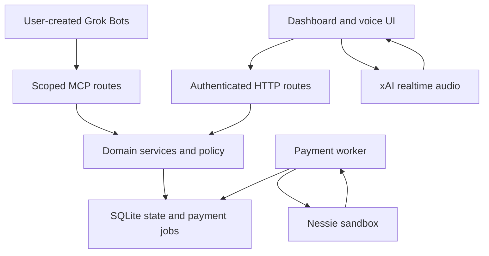

# Architecture and implementation

Sentinel's mission is to make delegated financial work visible and bounded for individuals and business teams. Native Grok Bots perform reasoning outside Sentinel. The app stores shared tasks, instructions, policies, approvals, and receipts. Embedded xAI voice exposes those same facts and human controls.

The browser executes voice function requests by calling the authenticated HTTP voice gateway. xAI does not connect directly to the database or banking adapter.

## Source map

| Location | Responsibility |
| --- | --- |
| `src/app/` | App Router pages and HTTP endpoints |
| `src/components/voice-panel.tsx` | Mic, socket, playback, lifecycle, transcript UI, authority draft review |
| `src/client/audio.ts`, `voice-calls.ts` | Stateful resampling/framing and parallel function output sequencing |
| `src/server/auth/config.ts` | Better Auth sessions, JWT issuer, OAuth provider, guarded resource registration |
| `src/server/env.ts`, `origins.ts`, `http.ts` | Validated environment, explicit origin trust, sessions, bounded JSON/errors |
| `src/contracts/` | Money, states, categories, errors, voice schemas |
| `src/domain/workspaces.ts`, `access.ts` | Membership, invitations, roles, fresh password grants |
| `src/domain/accounts.ts` | Provider-backed accounts, observations, protections, workspace merchant mappings |
| `src/domain/authority.ts` | Registrations, MCP connections, mandates, pause/revoke/archive |
| `src/domain/proposals.ts`, `policy.ts` | Task leases/revisions, immutable proposals, limits and approval |
| `src/domain/settlement.ts` | Submission, receipt matching, reconciliation, recovery, housekeeping |
| `src/domain/voice.ts`, `agent-state.ts` | Bound voice sessions/tools and common persisted agent state |
| `src/mcp/` | Token checks and ten narrow tools |
| `src/banking/` | Nessie boundary and normalized provider types |
| `src/storage/` | SQLite transactions, schema and versioned application migrations |
| `src/worker/main.ts` | Long-running payment and reconciliation loop |
| `scripts/` | Node/runtime setup, migrations, dev/build/start, operator customer grants |
| `test/`, `e2e/` | Isolated regression fixtures and browser tests |

## Authority and isolation

Roles, membership, connection state, registration controller, account grants and mandate terms come from the database. Caller-provided role or approval claims have no authority. Domain mutations recheck the live membership; asynchronous provider reads recheck account binding and wallet versions before applying results.

A personal workspace has one owner. Businesses support owners, finance reviewers, and members. Owners grant financial authority and account read access. Finance can review eligible proposals but cannot grant itself account access or raise mandates. Members see their permitted accounts and work they author or control. Business self-approval is blocked for requester, controller, and intent author.

Each OAuth connection has its own resource URL. MCP checks issuer, audience, subject/controller match, active membership, live connection, scopes, and mandate expiry. Potential consent scope `proposals:write` is enabled only while a valid mandate exists. Consent itself grants no spending limit.

## Purchase lifecycle

Money is stored as integer USD cents. A mandate is a lifetime allowance with a purchase cap, review threshold, expiry, category/optional merchant constraints, and execution mode. Replacing it creates a new authority record. Protected funds and existing holds reduce spendable money.

1. A human creates a task bound to a Bot and an active mandate.
2. The connector claims an eligible task and obtains a short-lived lease tied to its connection and current revision.
3. The Bot submits immutable purchase terms. The server computes limits and returns blocked, review-required, or reserved.
4. Review-required proposals hold no funds. Eligible approval checks the exact terms hash and current policy again.
5. Reserving funds and creating the payment job occur in one SQLite transaction.
6. The worker refreshes the bank observation and rechecks authority, lease connection, expiry, protections and available funds before submission.
7. The worker records a submission reference before its one provider POST. A timeout or process interruption leads to read-only reconciliation, never automatic POST replay.
8. A matching completed receipt debits the policy balance and releases the hold once. Pending, missing, ambiguous or unrelated receipts retain the hold and eventually require review.

One unresolved operation per wallet is enforced with a database index. Pause cancels unsubmitted proposals and releases their holds. Submitted payments continue reconciliation because pausing cannot undo an upstream submission.

Observed balances remain separate from the policy balance. An unexplained difference with no operation in flight quarantines the wallet. A fresh owner-confirmed baseline is permitted only after unresolved work has been cleared.

Nested domain transactions use SQLite savepoints. A voice mutation and its replay journal therefore commit together or both roll back.
