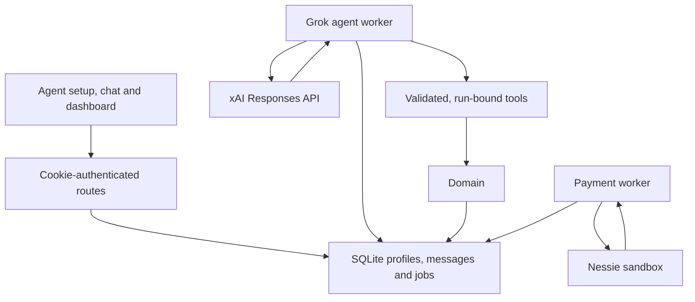

# Architecture and implementation

Sentinel's mission is to make delegated financial work visible and bounded for individuals and business teams. Users create Grok-powered agents on-site. Humans grant account access and spending authority; Grok reasons over authorized records and requests narrow domain tools. Financial completion is determined by persisted Nessie receipts.

The model never receives a database connection or bank credential. Text function calls are executed by the server. Agent creation/configuration does not invoke a native bot provisioning API.

## Source map

| Location | Responsibility |
| --- | --- |
| `src/app/w/[workspaceId]/bots/` | Create/list agents and existing redesigned detail UI |
| `src/components/agent-profile.tsx` | Profile editing, read-grant choices and legacy conversion |
| `src/components/agent-chat.tsx` | Per-user persisted chat, purchase consent, run activity and explicit retry |
| `src/domain/agents.ts` | Agent profiles, internal contexts, durable chat queue, scheduling, limits, live control checks |
| `src/agents/grok-client.ts` | Bounded xAI HTTP transport, validation, manual function-call history and safe errors |
| `src/agents/runner.ts` | Claims, heartbeat, stale-run recovery, account refresh, bounded execution and summaries |
| `src/agents/tools.ts` | Strict tool schemas, server-bound task leases, replay journal and domain dispatch |
| `src/worker/agents.ts` | Long-running agent loop and shutdown cancellation |
| `src/server/auth/` | Better Auth sessions and optional MCP OAuth |
| `src/server/env.ts`, `http.ts`, `origins.ts` | Server-only config, bounded JSON, session resolution and exact-origin checks |
| `src/domain/access.ts`, `workspaces.ts` | Live membership, roles, invitation links and password grants |
| `src/domain/accounts.ts` | Account bindings, observations, protected funds and merchant-category mappings |
| `src/domain/authority.ts` | Agent registrations, read grants, allowances and lifecycle |
| `src/domain/proposals.ts`, `policy.ts` | Task leases/revisions, immutable proposals, limits and human approvals |
| `src/domain/settlement.ts`, `src/worker/main.ts` | At-most-one recorded submission, receipt checks and reconciliation |
| `src/banking/` | Nessie server adapter and checked cents/provider parsing |
| `src/storage/` | SQLite, independent auth/domain connections and versioned migrations |
| `scripts/`, `docker-compose.yml` | Web plus both workers, builds, migrations and local operation |
| `test/`, `e2e/`, `playwright*.config.ts` | Isolated unit/domain/provider/browser verification |

## Persistent agent state

Existing registrations remain the canonical agent identity, controller and workspace binding. `agent_profiles` adds custom instructions and the internal execution connection. `agent_conversations` has one row per agent/user; messages are immutable user/assistant text. `agent_runs` stores chat/task jobs, model, original message or task binding, state, claim deadline, counters, summary and safe error code. `agent_tool_calls` stores call IDs, request hashes and bounded tool results. `agent_worker_status` exposes liveness.

The internal connection uses `auth_mode=INTERNAL`, no token hash and a non-HTTP resource URI. External MCP authentication rejects it. It reuses connection-bound financial leases and existing live authorization, rather than granting the model an owner session. Account read grants and mandate terms are read from the database for each relevant operation.

Migration 003 rebuilds only the connection CHECK constraint where necessary, copies existing rows in one transaction, creates agent tables, checks all foreign keys before committing and restores enforcement even on failure. Existing users, tasks and financial records remain intact. There is no downgrade migration.

## Execution lifecycle

1. The HTTP route resolves the current human from a session cookie and live membership, checks Origin and strict fields, and writes a chat message plus queued run atomically. Idempotency prevents duplicate HTTP submissions under the same key.
2. The scheduler queues eligible task events for on-site active agents. A key based on task, execution epoch and all instruction IDs prevents repeated polling from becoming repeated model runs. Resume advances the epoch. Applied instructions do not change the event watermark.
3. The worker atomically claims one run with a random token and a 30-second deadline, refreshed every five seconds. A partial unique index enforces one RUNNING job per agent.
4. Purchase tasks refresh stale authorized account facts before claiming. A task run then obtains a domain task lease. Its plaintext stays in local worker memory, outside prompts and result journals.
5. The system prompt distinguishes permissions from custom instructions and untrusted records. Chat receives bounded per-user history through its original message; task runs receive no private chat.
6. `POST /v1/responses` uses the configured Grok model, `store:false`, strict function schemas, serial tool calls, token/request bounds and manual context. Each visible function call and its corresponding output is preserved for the next turn; no stored response ID is assumed.
7. The server validates a tool's arguments and checks the current claim, active agent, controller/requester membership and permitted target before every action. Each domain mutation and replay journal commit in one transaction. A savepoint rolls back a failed tool while preserving its error record.
8. A normal final response becomes a persisted assistant message or task-run summary. It is model-reported text; task completion and payment states are independent persisted domain facts. Polling exposes finished messages and observed tools, not streamed tokens or hidden reasoning.
9. Pause, removal, archival, shutdown or a lost claim prevents late tool mutations after provider I/O. A crashed claim becomes FAILED, never automatically replays side effects, and must be reviewed before a retry. Original-message task creation remains idempotent across retries.

## Authority and isolation

Owners grant financial authority and business read access. Finance reviewers may review eligible proposals and pause organization agents, but cannot edit others' agent profiles or raise allowances. Members operate their own agents and permitted accounts. Agent creation assigns the creating user as controller. Owners may configure/chat with an existing member-controlled agent; chat-created tasks retain the actual human author. Task execution retains the original controller, and business self-approval checks still exclude requester/controller/intent author.

Custom instructions never become permissions. A default chat message cannot create a purchase task unless the human selected a valid allowance. Task mutations inject identity, task, revision and lease on the server. There are no approval, bank POST, authority-editing, raw SQL or arbitrary network tools. Instruction acknowledgements and application are distinct recorded states.

Auth and financial domains share the SQLite file through separate connections. Auth's bare prepared BEGIN is promoted to BEGIN IMMEDIATE to prevent an upgrade from an outdated WAL snapshot while workers write. Synchronous domain transactions use BEGIN IMMEDIATE and nested savepoints; they cannot join an asynchronous file-backed auth transaction. Provider calls never occur inside domain SQLite transactions.

## Financial lifecycle

Money uses integer USD cents. A lifetime allowance includes a total, per-purchase cap, review threshold, expiry, categories, optional merchant list and execution mode. Protected floors and current holds reduce availability. Replacement creates a new grant rather than rewriting historical spending.

Purchase proposals are immutable within a task revision. The policy engine returns BLOCKED, REVIEW_REQUIRED or RESERVED. Review holds no funds; approval rechecks exact terms and current policy. Reservation and payment-job creation commit together. The payment worker independently checks authority, connection, observed balance, limits and unresolved operations before recording one submission reference and issuing one Nessie POST.

Timeouts, crashes and ambiguous receipts lead to read-only reconciliation. A matching account/merchant/amount/ID/reference and completed receipt debit the policy balance and release the hold once. Missing/pending/unrelated receipts preserve holds and may require manual review. Pause cannot undo a recorded upstream submission.

Nessie is a sandbox banking API. Merchant catalog entries are not product prices. The app has no retailer checkout, live customer OAuth banking, transfers or bill-pay execution. Research analyzes recorded data and explicitly provided facts; it has no web-search tool.
